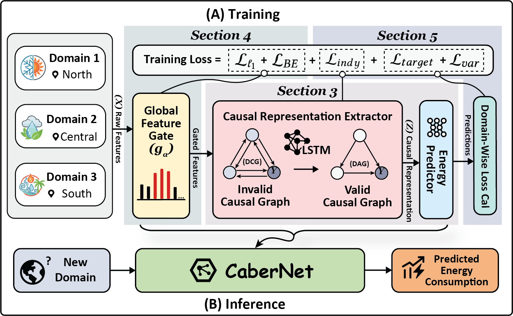

This repository contains the code for the paper *"CaberNet: Causal Representation Learning for Cross-Domain HVAC Energy Prediction"*, which has been **accepted as a full paper at ACM e-Energy 2026**.
## Overview
This repository contains the implementation of CaberNet and several benchmark models for energy prediction and causal inference experiments. The framework of CaberNet is shown below.
<div align="center">
  
</div>

## File Structure

-  **main.py**  
  Change 'train_dic' and 'test_dic' variables for different train and test set split.

-  **Quick Run**

    training and test CaberNet:
    ```bash
    python main.py --model my_model --LLO 0 --train domain_wise --lr 5e-5 --epochs 500
    ```
    training and test lstm (baseline):
    ```bash
    python main.py --model lstm --LLO 0 --train normal --lr 5e-5 --epochs 500
    ```

- **model/**  
  - `my_model.py` and `cond_nn.py`: Implementation of CaberNet.  
  - `lstm.py`: baseline.

- **utils/**  
  - `train.py`: Training pipeline.  

- **result/**  
  Contains results from training and causal inference experiments.  

## Notes
- Before running, please adjust the files related to data processing and data engineering to the correct format.
- Feel free to post a issue or connect if there are any quesions.
## License
This project is licensed under the MIT License.
## Citation
If you found the work helpful, please cite our [paper](https://arxiv.org/abs/2511.06634):
```
@article{zhai2025cabernet,
  title={CaberNet: Causal Representation Learning for Cross-Domain HVAC Energy Prediction},
  author={Zhai, Kaiyuan and Cui, Jiacheng and Zhang, Zhehao and Xue, Junyu and Deng, Yang and Wu, Kui and Tang, Guoming},
  journal={arXiv preprint arXiv:2511.06634},
  year={2025}
}
```